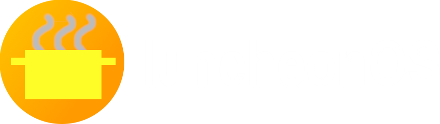

# luncheonOS

> *A Steam Deck UI gaming OS using custom software with Valve software.*
## Notes
- This project is very much in development, and is NOT AT ALL ready for use. It'll be a long way until it's ready.
- I am a student developer, so I'm still learning. A lot. So, if any code is unoptimized, feel free to fork it and propose the optimized changes!
- Also, I don't have money for GitHub Actions billing, so please don't exceed 2,000 minutes build time. If that ***somehow*** happens, email me at [my email address](mailto:frothyy@frothywifi.cc) and I'll build images myself.
- Atomic editions are not ready yet because they are not the current main focus. And this OS isn't even done yet.
> *"Uh, what am I supposed to put here again?"* -me lmao
